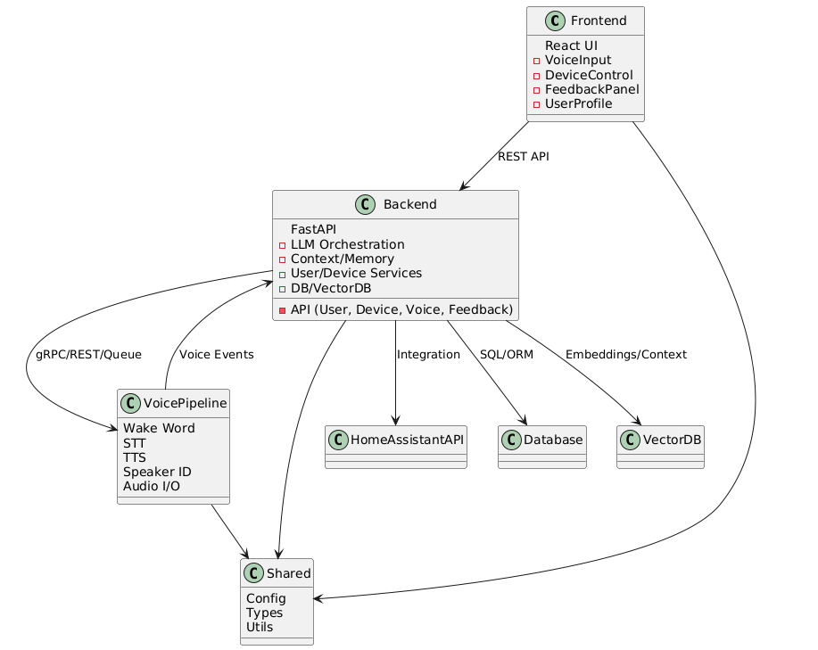

# System Architecture

## Directory Structure

```
home_assistant/
├── backend/
│   └── app/
│       ├── api/
│       ├── services/
│       ├── models/
│       ├── db/
│       └── utils/
├── voice/
│   └── app/
│       ├── wakeword/
│       ├── stt/
│       ├── tts/
│       ├── speaker_id/
│       ├── audio/
│       └── feedback/
├── shared/
│   ├── config/
│   ├── types/
│   └── utils/
├── frontend/
│   ├── public/
│   └── src/
│       ├── api/
│       ├── components/
│       ├── pages/
│       ├── styles/
│       └── utils/
├── scripts/
└── docs/
```

## Architecture Diagram



- **Frontend:** React UI for user interaction, feedback, and monitoring.
- **Backend:** FastAPI for API, LLM orchestration, context, and device/user management.
- **Voice Pipeline:** Handles wake word, STT, TTS, speaker ID, and audio I/O.
- **Shared:** Common types, config, and utilities.
- **Integrations:** Home Assistant API, SQL/Vector DBs.

> See `system_architecture.puml` for the PlantUML source. 