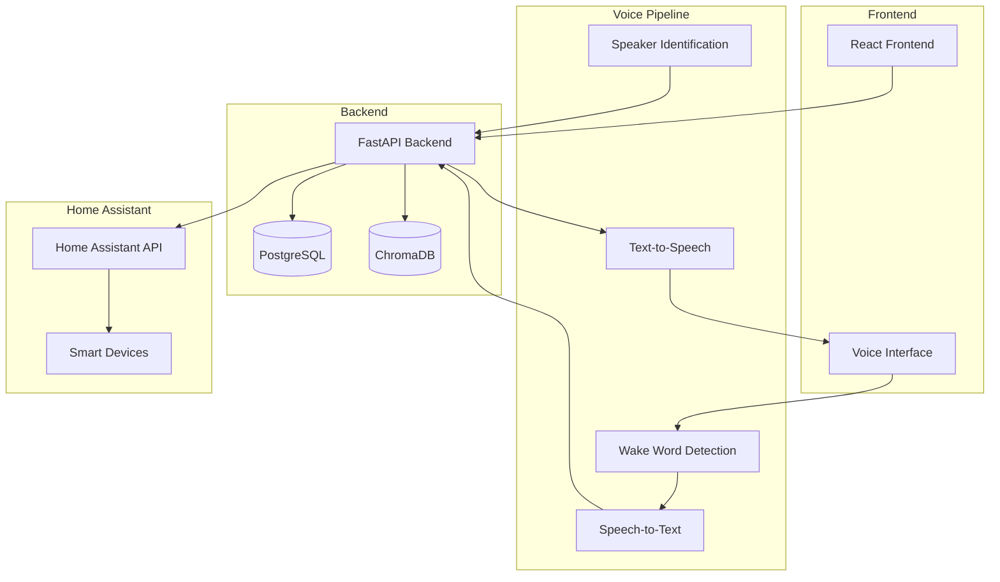
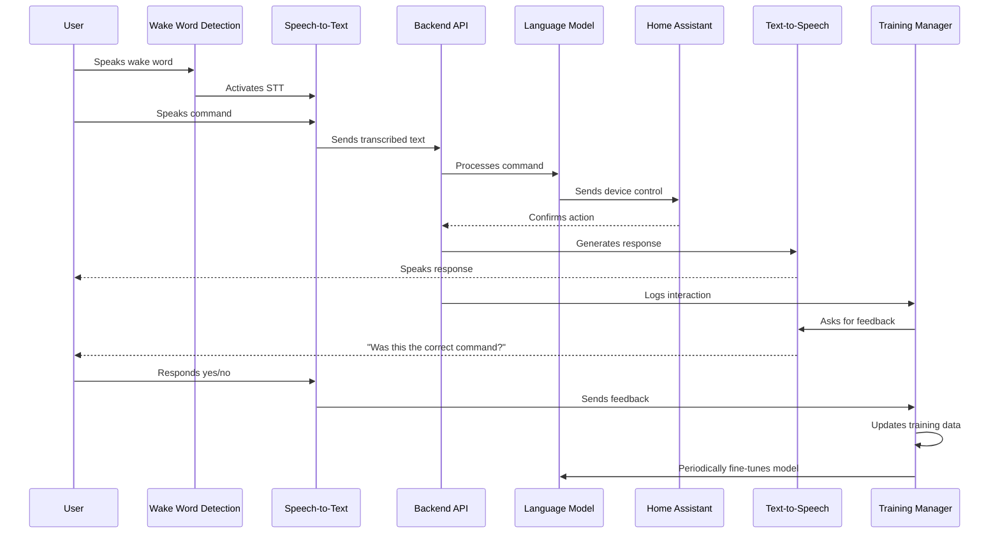
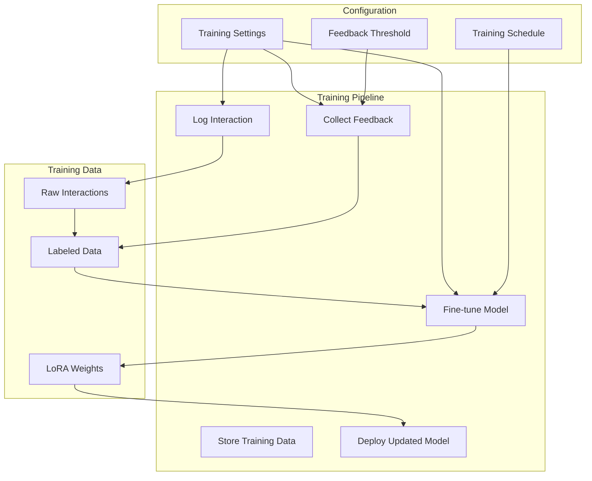
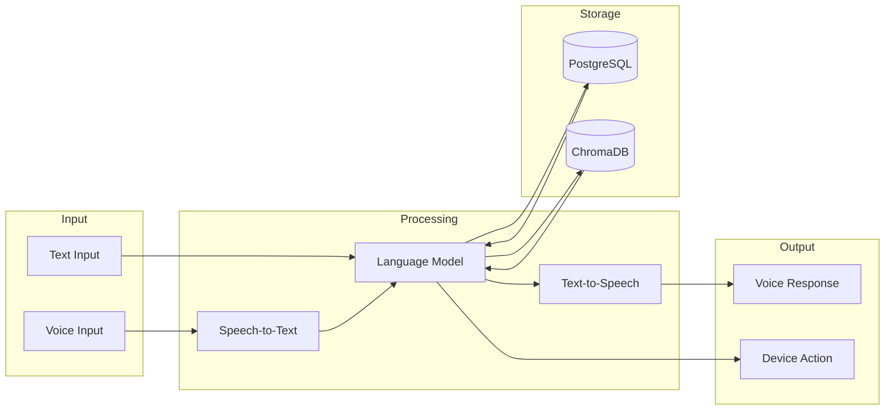
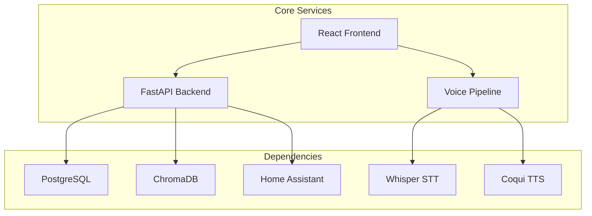

# Home Assistant Voice LLM - System Flow Diagram

## High-Level System Architecture

## Voice Command Processing Flow

## Training Flow

## Data Flow and Storage

## Component Dependencies

## Notes
- The system uses a modular architecture allowing for easy updates and maintenance
- Voice pipeline components can be swapped out (e.g., different STT/TTS engines)
- ChromaDB stores conversation context and embeddings
- PostgreSQL stores user data, preferences, and interaction history
- Home Assistant integration enables control of smart home devices
- The frontend provides both voice and traditional UI interfaces
- Training feedback loop enables continuous model improvement
- LoRA fine-tuning allows efficient model updates without full retraining
- Training settings can be configured for:
  - Feedback collection frequency
  - Training schedule
  - Minimum feedback threshold
  - Model update criteria 